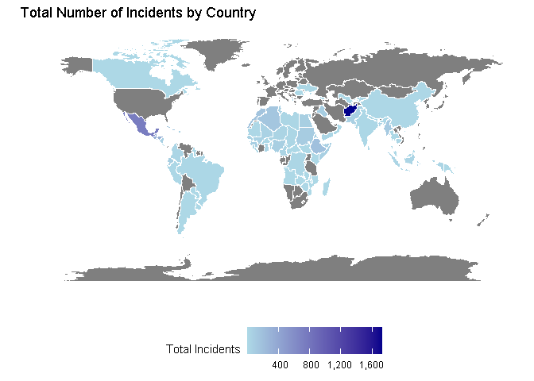
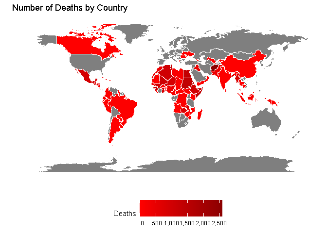
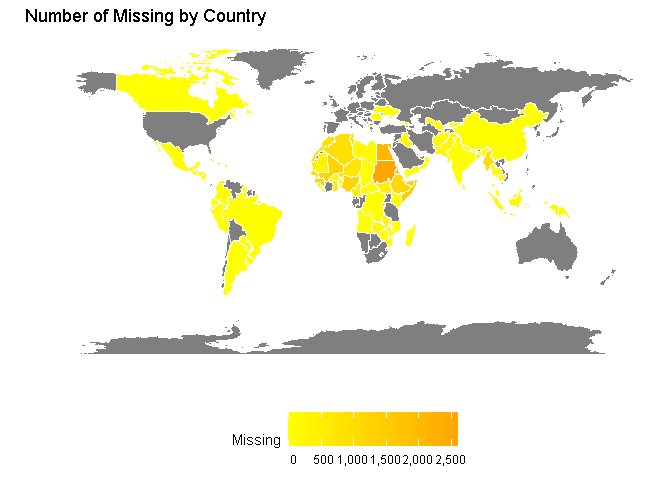
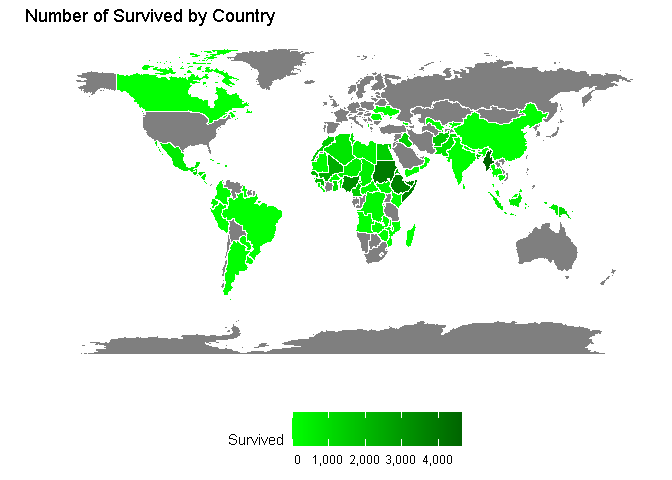
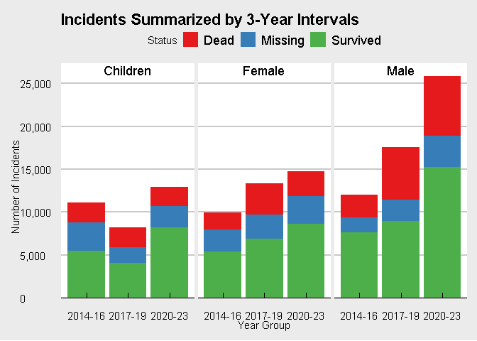
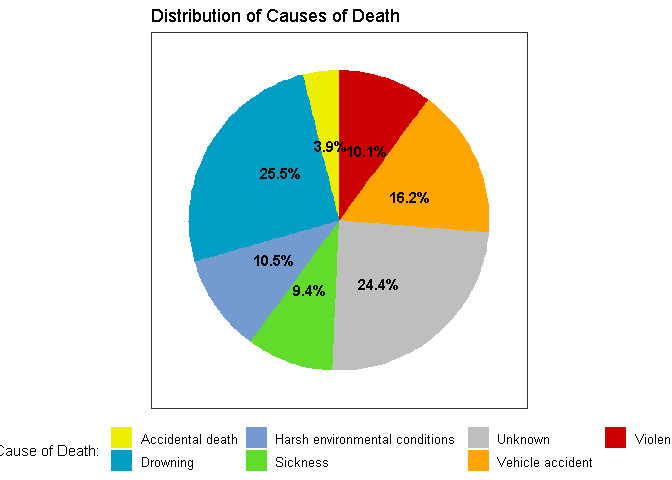
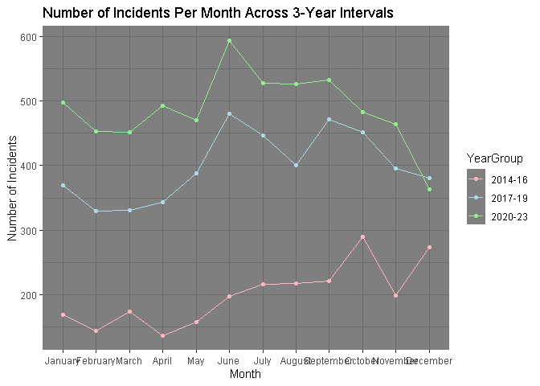

# Introduction

In this report, I will explore the dataset of global missing migrants which has been collected and kept by IOM since 2014 I saw it on Kaggle and it piqued my interest because of how well kept and documented it is and the interesting information it provides.

The questions I explored were migrants of which countries are more likely to end up in an incident and if mapping it will give us any patterns. how many incidents happen per year is it increasing or decreasing is it true among all demographics? then I explored the cause of death and which cause is responsible for what ratio of the deaths, i also explored incident count in a given month and if there is any pattern to it.

IMPORTANT: These are reported incidents that means there are much more incidents than in dataset also reported insidents are more likeley to have survivors.

# Data Loading and Preparation
Libararies , data and world map object. I have also disabled warnings to make the note book prettier.

```r
options(warn=-1)
library(tidyverse)
library(ggplot2)
library(maps)
library(scales)
library(dplyr)
library(ggthemes)
library(stringr)
library(lubridate)
library(scales)

#loading data
d <- read.csv("Global Missing Migrants Dataset.csv")
# Get world map data
world_map <- map_data("world")
```


# Data Analysis and Visualization


## Country of origin of migrants
I took incident counts then seperated by survived status , mapped it to the world.I wanted to use facet but it made the 4 plots very unreadable regardless of the scale so i made 4 seperate plots.
since its 4 back to back plots i thought minimal was the best theme.

```r
#total incident per country
incidents_total <- d %>%
  separate_rows(Country.of.Origin, sep = "[,;/]") %>%
  group_by(Country.of.Origin) %>%
  summarise(Total_Incidents = n(), .groups = 'drop')

#seperating dead surviivor and missing
incidents_details <- d %>%
  filter(!is.na(Number.of.Dead) | !is.na(Minimum.Estimated.Number.of.Missing) | !is.na(Number.of.Survivors)) %>%
  separate_rows(Country.of.Origin, sep = "[,;/]") %>%
  group_by(Country.of.Origin) %>%
  summarise(Deaths = sum(Number.of.Dead, na.rm = TRUE),
            Survived = sum(Number.of.Survivors, na.rm = TRUE),
            Missing = sum(Minimum.Estimated.Number.of.Missing, na.rm = TRUE), .groups = 'drop')

#joining map object with data
mapped_data <- world_map %>%
  left_join(incidents_total, by = c("region" = "Country.of.Origin")) %>%
  left_join(incidents_details, by = c("region" = "Country.of.Origin"))


# Map of Total Incidents by Country

total_incidents_map <- ggplot(mapped_data,
                              aes(x = long,
                                  y = lat, 
                                  group = group, 
                                  fill = Total_Incidents)) +
  geom_polygon(color = "white") +
  scale_fill_gradient(low = "lightblue",
                      high = "darkblue",
                      na.value = "grey50",
                      name = "Total Incidents",
                      labels = function(x) format(x, big.mark = ",")) +  # Custom labels with commas
  labs(title = "Total Number of Incidents by Country",
       x = "",
       y = "") +
  theme_minimal() +
  theme(legend.key.size = unit(0.9, "cm"), 
        legend.position = "bottom",
        axis.text.x = element_blank(),
        axis.text.y = element_blank()) +
  scale_x_continuous(name = "", 
                     breaks = NULL) +  # Hides x-axis labels and ticks
  scale_y_continuous(name = "", 
                     breaks = NULL)  # Hides y-axis labels and ticks

# i realize now using to many new lines makes things unreadable
# Map of Deaths by Country
deaths_map <- ggplot(mapped_data, aes(x = long, y = lat, group = group, fill = Deaths)) +
  geom_polygon(color = "white") +
  scale_fill_gradient(low = "red", high = "darkred", na.value = "grey50", name = "Deaths",
                      labels = function(x) format(x, big.mark = ",")) +  
  labs(title = "Number of Deaths by Country", x = "", y = "") +
  theme_minimal() +
  theme(legend.key.size = unit(0.9, "cm"), legend.position = "bottom", axis.text.x = element_blank(), axis.text.y = element_blank()) +
  scale_x_continuous(name = "", 
                     breaks = NULL) +  # Hides x-axis labels and ticks
  scale_y_continuous(name = "", 
                     breaks = NULL)  # Hides y-axis labels and ticks

# Map of Missing by Country
missing_map <- ggplot(mapped_data, aes(x = long, y = lat, group = group, fill = Missing)) +
  geom_polygon(color = "white") +
  scale_fill_gradient(low = "yellow", high = "orange", na.value = "grey50", name = "Missing",
                      labels = function(x) format(x, big.mark = ",")) +  
  labs(title = "Number of Missing by Country", x = "", y = "") +
  theme_minimal() +
  theme(legend.key.size = unit(0.9, "cm"), legend.position = "bottom", axis.text.x = element_blank(), axis.text.y = element_blank()) +
  scale_x_continuous(name = "", 
                     breaks = NULL) +  # Hides x-axis labels and ticks
  scale_y_continuous(name = "", 
                     breaks = NULL)  # Hides y-axis labels and ticks

# Map of Survivors by Country
survivors_map <- ggplot(mapped_data, aes(x = long, y = lat, group = group, fill = Survived)) +
  geom_polygon(color = "white") +
  scale_fill_gradient(low = "green", high = "darkgreen", na.value = "grey50", name = "Survived",
                      labels = function(x) format(x, big.mark = ",")) + 
  labs(title = "Number of Survived by Country", x = "", y = "") +
  theme_minimal() +
  theme(legend.key.size = unit(0.9, "cm"), legend.position = "bottom", axis.text.x = element_blank(), axis.text.y = element_blank()) +
  scale_x_continuous(name = "", 
                     breaks = NULL) +  # Hides x-axis labels and ticks
  scale_y_continuous(name = "", 
                     breaks = NULL)  # Hides y-axis labels and ticks
```
<!-- --><!-- --><!-- --><!-- -->

## Analasys:
certain regions of the world have higher incident counts and they are almost clustered toghether and if we really pay attention we can see some countries with higher incident counts have lower or as much as its neighbouring countries.

## Incident count by gender per year
The plot is showing  icident count per 3-year groups and stacked status ratio also faceted by demographic.


```r
# Custom function to group years into 3-year intervals
group_years <- function(year) {
  if (year %in% 2014:2016) {
    return("2014-16")
  } else if (year %in% 2017:2019) {
    return("2017-19")
  } else if (year %in% 2020:2023) { 
    return("2020-23")
  } else {
    #unecessary but doesnt hurt to have good programming practices
    return(as.character(year)) 
  }
}

#making years to be in 3 yea intervals so the chart will be more readable
d$Year_Group <- sapply(d$Incident.year, group_years)

# double grouping for some reason didnt work so here i am
incidents_by_year_gender <- d %>%
  group_by(Year_Group) %>%
  summarise(Male_Survived = sum(Number.of.Survivors * (Number.of.Males > 0), na.rm = TRUE),
            Female_Survived = sum(Number.of.Survivors * (Number.of.Females > 0), na.rm = TRUE),
            Children_Survived = sum(Number.of.Survivors * (Number.of.Children > 0), na.rm = TRUE),
            Male_Dead = sum(Number.of.Dead * (Number.of.Males > 0), na.rm = TRUE),
            Female_Dead = sum(Number.of.Dead * (Number.of.Females > 0), na.rm = TRUE),
            Children_Dead = sum(Number.of.Dead * (Number.of.Children > 0), na.rm = TRUE),
            Male_Missing = sum(Minimum.Estimated.Number.of.Missing * (Number.of.Males > 0), na.rm = TRUE),
            Female_Missing = sum(Minimum.Estimated.Number.of.Missing * (Number.of.Females > 0), na.rm = TRUE),
            Children_Missing = sum(Minimum.Estimated.Number.of.Missing * (Number.of.Children > 0), na.rm = TRUE)) %>%
  pivot_longer(cols = -Year_Group, names_to = "Category", values_to = "Incidents")

# splitting category into gender and status
incidents_by_year_gender <- incidents_by_year_gender %>%
  separate(Category, into = c("Gender", "Status"), sep = "_")

#The plot
ggplot(incidents_by_year_gender, aes(x = Year_Group, y = Incidents, fill = Status)) +
  geom_bar(stat = "identity", 
           position = "stack") +
  facet_wrap(~Gender,
             scales = "fixed") +  
    scale_x_discrete(name = "Year Group", 
                   breaks = unique(incidents_by_year_gender$Year_Group)) +  # x lable scaling
  scale_y_continuous(name = "Number of Incidents", 
                     labels = scales::comma,  # comma formatting
                     expand = c(0,0),  # less expanding
                     limits = c(0, NA)) +  # y should start at 0 to repsent data truthfully
  theme_economist_white() +  # Economist white contrasts the colors of set1 really nice
  scale_fill_brewer(palette = "Set1") + #scale so all of them have the same y
  labs(x = "Year Group",
       y = "Number of Incidents",
       title = "Incidents Summarized by 3-Year Intervals")
```

<!-- -->

## Analasys:
We can thankfully see children are less envoloved in general in incidents. As expected the ratio of surviving memebrs of the incidents are higher and the number of incidents are on the rise as the years pass by.

## Cause of death ditribuation
Looking at different causes of death and seeing what ratio of the death's are they responsible for. 


```r
# cleaning data -_-
d$Cause.of.Death <- str_replace(d$Cause.of.Death, "Mixed or unknown", "Unknown")
d$Cause.of.Death <- str_replace_all(d$Cause.of.Death, "/.*", "")

#some of the cleanings i wanted to be permanant.
d <- d %>%
  mutate(Cause.of.Death = str_split(Cause.of.Death, ",\\s*")) %>%
  unnest(Cause.of.Death)

#grouping by cause of death
cause_of_death_counts <- d %>%
  group_by(Cause.of.Death) %>%
  summarise(Count = n(), .groups = 'drop') %>%
  mutate(Percentage = Count / sum(Count) * 100)

#coloring what i think is the most intuitive color for its repective cause of death
colors <- c(
  "Accidental death" = "yellow2",
  "Drowning" = "#009dc4", #water blue
  "Harsh environmental conditions " = "#739bd0", #ice blue
  "Sickness " = "#60DD2A", #this green is used for toxin
  "Unknown" = "grey",
  "Vehicle accident " = "orange1",
  "Violence" = "red3"
)

#The plot
ggplot(cause_of_death_counts, aes(x = "", y = Count, fill = Cause.of.Death)) +
  geom_bar(stat = "identity",
           width = 1) +
  coord_polar("y",
              start = 0) +
  theme_void() +
  scale_fill_manual(values = colors) +
  geom_text(aes(label = paste0(round(Percentage, 1), "%")),
            position = position_stack(vjust = 0.6),
            size = 4, fontface = "bold",
            hjust = 0.5) +
  labs(fill = "Cause of Death: ", 
       title = "Distribution of Causes of Death") +
  theme_test()+ #found it randomly and it looks great
  theme(axis.title = element_blank(),  #I hate pie charts clean everything then redraw all of them
        axis.text.x = element_blank(), 
        axis.ticks = element_blank(), 
        legend.position = "bottom", 
        legend.text = element_text(size = 10))
```

<!-- -->

## Analasys:
most deaths are cause by drowning and vehicle accidents which i think means most of incidents happened between borders.

## Travel pattern in a year
Just checking if migrants tend to travel more in which month and if its consistent


```r
# calculated incident per motnh and grouping them by years
d <- d %>%
  mutate(YearGroup = sapply(`Incident.year`, group_years),
         `Reported.Month` = factor(`Reported.Month`, levels = c("January", "February", "March", "April", "May", "June", "July", "August", "September", "October", "November", "December")))

monthly_incidents <- d %>%
  group_by(YearGroup, `Reported.Month`) %>%
  summarize(Incidents = n()) %>%
  ungroup() %>%
  arrange(match(`Reported.Month`, levels(`Reported.Month`))) # Ensure months are in correct order
```

```
## `summarise()` has grouped output by 'YearGroup'. You can override using the
## `.groups` argument.
```

```r
#The plot
ggplot(monthly_incidents, aes(x=`Reported.Month`, y=Incidents, group=YearGroup, color=YearGroup)) +
  geom_line() + geom_point() +
  labs(title="Number of Incidents Per Month Across 3-Year Intervals",
       x="Month",
       y="Number of Incidents") +
  theme_dark() + #just trying something different
  #light colors for the dark theme.
  scale_colour_manual(values=c("2014-16"="#FFB6C1", "2017-19"="#ADD8E6", "2020-23"="#90EE90")) +  
  #scaling the y properly
  scale_y_continuous(labels=scales::comma)  
```

<!-- -->

## Analasys:
Travel or at least the ones that end up being an incident are more common in the middle of the year.According to tourism Analyics people do indeed travel more in middle of the year and this information adds validity to our dataset. we can also see the increase in incidents in years which coincide by travel rates.

# Discussion
To summrize everything most incidents happen to migrants from south asia and africa and it effect women and children less (This could be the case of maybe they are less likley to survive).Migrants tent to survive incidents although more of said incidents are happening as years go by.Security measurments have to be tighter in middle of the year.

# References

- Tourism Analytics. U.S. citizens' outbound travel from the USA to international destinations fell by 66.4% in 2020. Retrieved from https://tourismanalytics.com/news-articles/us-citizens-outbound-travel-from-the-usa-to-international-destinations-fell-by-664-in-2020

- Giriyewithana, N. Global Missing Migrants Dataset. Retrieved from https://www.kaggle.com/datasets/nelgiriyewithana/global-missing-migrants-dataset/data

